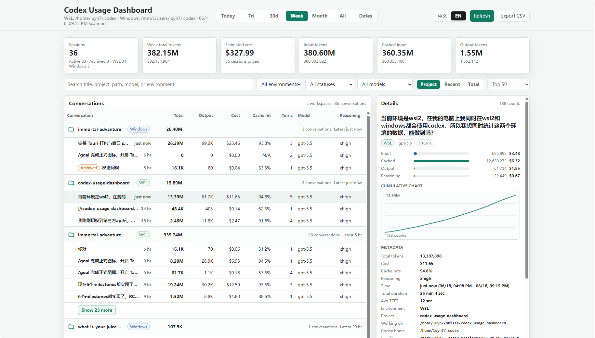

# Codex Usage Dashboard

Codex-only skill for a local OpenAI Codex usage dashboard.

It reads your local Codex session logs and opens a browser dashboard for per-conversation usage: total tokens, output tokens, estimated dollar cost, cache hit rate, turns, model, reasoning effort, tool calls, and token-count timeline. It can also import JSON snapshots exported from other devices, so each machine can show local realtime usage plus manually imported remote usage.

> Currently only supports OpenAI Codex. It is not a Claude Code, Cursor, Continue, or generic OpenAI API dashboard.


## Why This Exists

Most usage tools show daily or project-level totals. This dashboard focuses on the thing Codex users often want to know:

**Which Codex conversation used the most?**

It shows a searchable conversation list and a detail view for each session, including the cost split for input, cached input, output, and reasoning tokens.

## Install With The Skills CLI

Recommended global Codex install:

```bash
npx skills add luyh7/codex-usage-dashboard -g -a codex -y
```

Then restart Codex or open a new Codex conversation. Type `/usage`, then select the **Codex Usage Dashboard** skill.

The skill opens the local dashboard in your browser.

## Install With npx

GitHub installer:

```bash
npx github:luyh7/codex-usage-dashboard
```

Install and create a desktop shortcut:

```bash
npx github:luyh7/codex-usage-dashboard -- --shortcut
```

Install and open immediately:

```bash
npx github:luyh7/codex-usage-dashboard -- --open
```

## Features

- Per-conversation Codex usage from local session logs.
- Default project view, grouped by environment and workspace, with switches for recent and total-token list views.
- Compact list columns for total tokens, output tokens, cost, cache hit rate, turns, model, and reasoning effort.
- Detail view with token breakdown and estimated dollar cost for input, cached input, output, and reasoning.
- Token-count timeline with latest entries shown first.
- Tool call counts, project path, log file path, and session metadata.
- Local and read-only: reads Codex session logs from one or more local Codex homes; does not modify Codex logs.
- Manual multi-device snapshots: export `cousash-<device-short-code>.json` from one device and import it into another dashboard as remote data.
- WSL + Windows support: when running in WSL, automatically merges WSL `~/.codex` with Windows `/mnt/c/Users/<you>/.codex` when present.
- Cross-platform: works on Windows and macOS with Python 3.
- No API key required.

## What Gets Installed

The standard skills CLI installs:

```text
~/.codex/skills/codex-usage-dashboard
```

The bundled npm installer copies the same skill to that location.

Repository layout:

```text
skills/
  codex-usage-dashboard/
    SKILL.md
    agents/openai.yaml
    scripts/open_dashboard.py
    scripts/export_snapshot.py
    scripts/codex_usage_dashboard.py
    scripts/install_desktop_shortcut.py
    assets/codex_usage_dashboard.ico
```

## Manual Launch

After installation:

```bash
python ~/.codex/skills/codex-usage-dashboard/scripts/open_dashboard.py
```

On macOS you may need:

```bash
python3 ~/.codex/skills/codex-usage-dashboard/scripts/open_dashboard.py
```

The dashboard opens at:

```text
http://127.0.0.1:8765/
```

## Manual Multi-Device Usage

Open the dashboard on the receiving device:

```bash
python ~/.codex/skills/codex-usage-dashboard/scripts/open_dashboard.py
```

Export a snapshot on another device from the dashboard's **Export Snapshot** button, or run:

```bash
python ~/.codex/skills/codex-usage-dashboard/scripts/export_snapshot.py
```

The export command writes a JSON file named like:

```text
cousash-mac-9f3a72c1.json
```

In the dashboard, use **Import Remote Data** to import that JSON file. The device short code is stored inside the file and is used as the stable identity. Re-importing a newer file from the same device updates that remote data incrementally by session id. If there is no matching remote device yet, the dashboard asks for a display name.

Imported remote snapshots are stored outside the skill directory in the user's application config directory, so reinstalling the skill does not remove them. Remote data can be renamed or deleted from **Manage Remote Data**; deletion is permanent.

To force specific log roots, pass `--codex-home` one or more times:

```bash
python ~/.codex/skills/codex-usage-dashboard/scripts/codex_usage_dashboard.py \
  --codex-home ~/.codex \
  --codex-home /mnt/c/Users/<you>/.codex
```

## Data Source

The dashboard reads local Codex logs from each configured Codex home:

```text
~/.codex/sessions
~/.codex/archived_sessions
```

Under WSL, the default scan also includes:

```text
/mnt/c/Users/<you>/.codex/sessions
/mnt/c/Users/<you>/.codex/archived_sessions
```

It parses Codex `token_count` events, including `total_token_usage`, `last_token_usage`, model context window, task timing, and tool calls.

## Privacy

This is a local dashboard. It does not upload your Codex logs. It starts a local server bound to `127.0.0.1`.

## Limitations

- Codex-only: designed for OpenAI Codex Desktop/CLI local session logs.
- Cost is an estimate from public API prices and may not match ChatGPT/Codex subscription billing.
- Automatic remote syncing across machines is not included. Multi-device support is manual export/import. WSL + Windows works on the same machine when the Windows profile is mounted under `/mnt/c`.

## Keywords

OpenAI Codex usage dashboard, Codex token usage, Codex per conversation usage, Codex session usage, Codex output tokens, Codex cache hit rate, Codex cost estimate, Codex local logs, Codex skill, OpenAI Codex skill.
